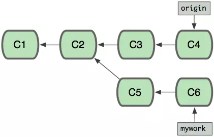
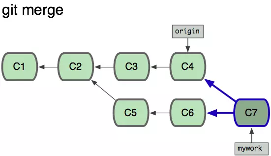
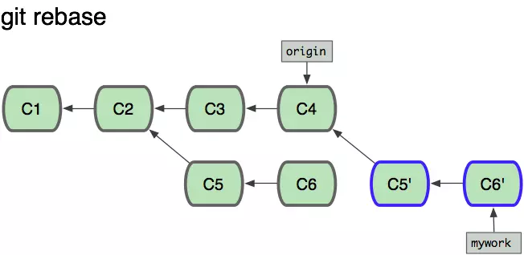
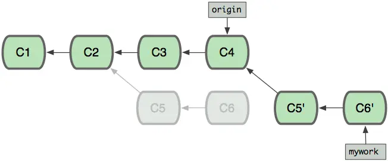

## 基本的几个概念


### 提交（Commit）

Git 将数据看做微型文件系统的一组快照。每次 **commit**（在 Git 中保持项目状态），它都对文件当时的状况拍照，并存储对该快照的引用。你可以将其看做游戏中的保存点，它会保存项目的文件和关于文件的所有信息。

你在 Git 中的所有操作都是帮助你进行 commit，因此 commit 是 Git 中的基本单位。

### 仓库（Repository / repo）

**仓库**是一个包含项目内容以及几个文件（在 Mac OS X 上默认地处于隐藏状态）的目录，用来与 Git 进行通信。仓库可以存储在本地，或作为远程副本存储在其他计算机上。仓库是由 commit 构成的。

### 工作目录 / 工作区（Working Directory）

**工作目录**是你在计算机的文件系统中看到的文件。当你在代码编辑器中打开项目文件时，你是在工作目录中处理文件。

与这些文件形成对比的是保持在仓库中（在 commit 中！）的文件。

在使用 Git 时，工作目录与命令行工具的 *current working directory* （当前工作目录）不一样，后者是 shell 当前正在查看的目录。

### 检出（Checkout）

**检出**是指将仓库中的内容复制到工作目录下。

### 暂存区 / 暂存索引 / 索引（Staging Area / Staging Index / Index）

Git 目录下的一个文件，存储的是即将进入下个 commit 内容的信息。可以将**暂存区**看做准备工作台，Git 将在此区域获取下个 commit。暂存索引中的文件是准备添加到仓库中的文件。

### SHA

**SHA** 是每个 commit 的 ID 编号。以下是 commit 的 SHA 示例：`e2adf8ae3e2e4ed40add75cc44cf9d0a869afeb6`。

它是一个长 40 个字符的字符串（由 0–9 和 a–f 组成），并根据 Git 中的文件或目录结构的内容计算得出。SHA 的全称是"Secure Hash Algorithm"（安全哈希算法）。如果你想了解哈希算法，请参阅我们的[计算机科学入门课程](https://www.udacity.com/course/intro-to-computer-science--cs101)。

### 分支（Branch）

**分支**是从主开发流程中分支出来的新的开发流程。这种分支开发流程可以在不更改主流程的情况下继续延伸下去。

回到之前关于游戏保存点的示例，你可以将分支看做在游戏中设立保存点后，尝试一个有风险的招式。如果有风险的招式不奏效，则回到保存的位置。令分支非常强大的关键之处是你可以在一个分支上设定保存点，然后切换到另一个分支并继续设定保存点。

#### 关于分支的几种操作
[Git知识总览(五) Git中的merge、rebase、cherry-pick以及交互式rebase](https://www.cnblogs.com/ludashi/p/8213550.html)

#####  cherry-pick (遴选)
可以选择某一个分支中的一个或几个commit(s)来进行操作。

主要使用的场合：

- 把弄错分支的提交移动到正确的地方
- 把其他分支的提交添加到现在的分支


它解决的问题就是：在本地 master 分支上做了一个commit ( 38361a68138140827b31b72f8bbfd88b3705d77a ) ，如何把它放到 本地开发 old_cc 分支上？

例如，假设我们有个稳定版本的分支，叫v2.0，另外还有个开发版本的分支v3.0，我们不能直接把两个分支合并，这样会导致稳定版本混乱，但是又想增加一个v3.0中的功能到v2.0中，这里就可以使用cherry-pick了。

```
# 先在v3.0中查看要合并的commit的commit id
git log
# 假设是 commit f79b0b1ffe445cab6e531260743fa4e08fb4048b

# 切到v2.0中
git check v2.0

# 合并commit
git cherry-pick f79b0b1ffe445cab6e531260743fa4e08fb4048b
```

当两个分支各自前进，即"分叉了后"

#####  git merge
在这里，你可以用"pull"命令把"origin"分支上的修改拉下来并且和你的修改合并； 结果看起来就像一个新的"合并的提交"(merge commit)。

#####  git rebase
但是，如果你想让"mywork"分支历史看起来像没有经过任何合并一样，你也许可以用 git rebase:

当'mywork'分支更新之后，它会指向这些新创建的提交(commit),而那些老的提交会被丢弃。 如果运行垃圾收集命令(pruning garbage collection), 这些被丢弃的提交就会删除. （请查看 git gc)


有点类似 git merge，但是两者又有不同，merge 适合那种比较琐碎的，简单的合并，系统级的合并还是用 rebase 吧。

打个比方，你有两个抽屉A和B，里面都装了衣服，现在想把B中的衣服放到A中，git merge 是那种横冲直撞型的，拿起B就倒入A里面，如果满了（冲突）再一并整理；而 git rebase 就很持家了，它会一件一件的从B往A中加，会根据一开始放入的时间顺序的来加，如果满了你可以处理这一件，你可以继续加，或者跳过这一件，又或者不加了，把A还原。


##  引用 commit :HEAD、master 与 branch 

### HEAD：当前 commit 的引用

上一段里说到，图中括号里是指向这个 `commit` 的引用。其中这个括号里的 `HEAD` 是引用中最特殊的一个：它是**指向当前 `commit` 的引用**。所谓**当前 `commit`**这个概念很简单，它指的就是当前工作目录所对应的 `commit`。

例如上图中的当前 `commit` 就是第一行中的那个最新的 `commit`。每次当有新的 `commit` 的时候，工作目录自动与最新的 `commit` 对应；而与此同时，`HEAD` 也会转而指向最新的 `commit`。事实上，当使用 `checkout`、`reset` 等指令手动指定改变当前 `commit` 的时候，`HEAD` 也会一起跟过去。

总之，当前 `commit` 在哪里，`HEAD` 就在哪里，这是一个永远自动指向当前 `commit` 的引用，所以你永远可以用 `HEAD` 来操作当前 `commit`。

### 总结


1. `HEAD` 是指向当前 `commit` 的引用，它具有唯一性，每个仓库中只有一个 `HEAD`。在每次提交时它都会自动向前移动到最新的 `commit` 。
2. `branch` 是一类引用。`HEAD` 除了直接指向 `commit`，也可以通过指向某个 `branch` 来间接指向 `commit`。当 `HEAD` 指向一个 `branch` 时，`commit` 发生时，`HEAD` 会带着它所指向的 `branch` 一起移动。
3. `master` 是 Git 中的默认 `branch`，它和其它 `branch` 的区别在于：
   1. 新建的仓库中的第一个 `commit` 会被 `master` 自动指向；
   2. 在 `git clone` 时，会自动 `checkout` 出 `master`。
4. `branch` 的创建、切换和删除：
   1. 创建 `branch` 的方式是 `git branch 名称` 或 `git checkout -b 名称`（创建后自动切换）；
   2. 切换的方式是 `git checkout 名称`；
   3. 删除的方式是 `git branch -d 名称`。

##  push的本质

1. `push` 是把当前的分支上传到远程仓库，并把这个 `branch` 的路径上的所有 `commit`s 也一并上传。
2. `push` 的时候，如果当前分支是一个本地创建的分支，需要指定远程仓库名和分支名，用 `git push origin branch_name` 的格式，而不能只用 `git push`；或者可以通过 `git config` 修改 `push.default` 来改变 `push` 时的行为逻辑。
3. `push` 的时候之后上传当前分支，并不会上传 `HEAD`；远程仓库的 `HEAD` 是永远指向默认分支（即 `master`）的。


## 常见的团队工作模型

### 最简单的基本模型 （集中式工作流）

1. git clone 一份远程仓库的代码
2. 完成自己的部分后，git add + git commit 后，git push
3. 如果有冲突，先 git pull 拉取远端最新的代码，在git push

### 功能分支工作流

1. git clone 一份远程仓库的代码
2. 任何新的功能（feature）或 bug 修复全都新建一个 branch 来写；
3. 将新的功能分支推送到远程仓库
4. 审核、通过了以后合并到 develop 或者 release 分支，让测试测试，通过后合并至master，并删除功能分支
5. 也可以使用 GitHub 的 `pull request` 将新分支推送之远端，在GitHub上确认是否合并至 master 分支

### GitFlow工作流


### Fork工作流


