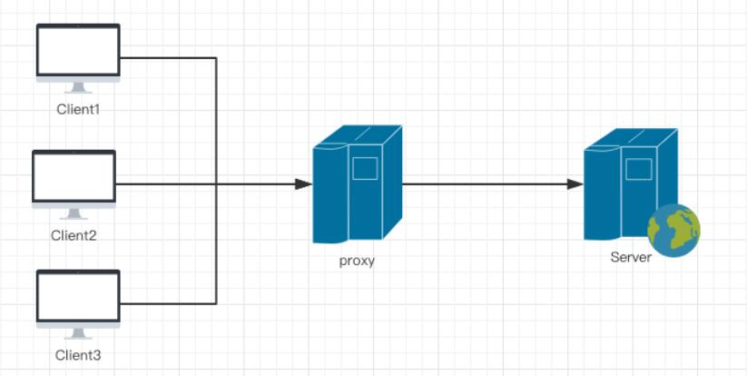
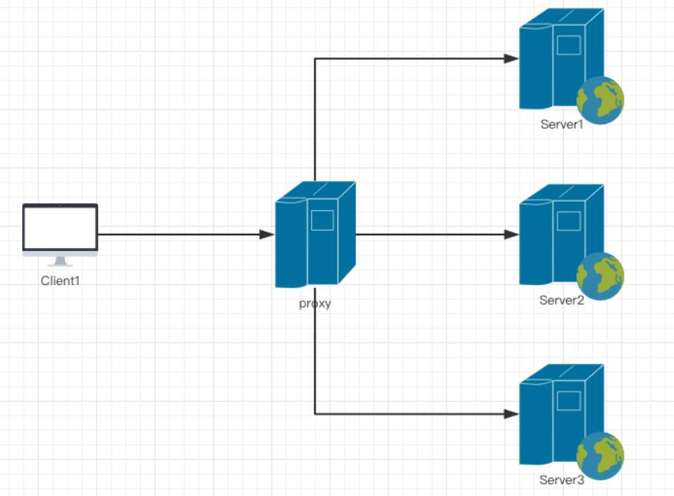
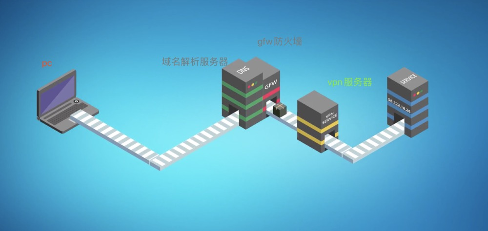

## 不同的翻墙技术原理 vpn ssr v2ray

### 正向代理

为客户端代理。中间代理服务器作为一个媒介，代理用户的请求到服务端，拿到服务端返回的结果后，再将结果返回给用户的行为。

对客户端透明，对服务端非透明；服务端不知道接受的请求是来自代理服务器，还是傻傻地以为请求是来自真正的用户的。



#### 正向代理的用处

- 翻墙

### 反向代理

为服务器代理。中间代理服务器接收用户请求，中间代理服务器决定去把请求发送到哪个服务器去。从而帮服务器做请求转发，负载均衡等。

对服务端透明，对客户端不透明；客户端不知道访问的是代理服务器，服务端对其知晓的。



如上图：如果用户想要访问 `server1`,通过中间服务器代理，可以让 `server2 / server3` 为用户提供服务。

#### 反向代理用处

- 安全，因为中间代理服务把原始服务隐藏掉了。

- 跨域

- 压缩

- 负载均衡：多个中间代理服务器构成的服务器集群。假如只有一个中间代理服务器并且发生了故障，就产生了单点故障，服务停止。此时就应使用多个中间代理服务器去代理不同服务。

- 缓存等

### 正向代理、反向代理异同

同：中间代理服务器都是用来接受请求、响应内容的。

异：

1. 正向代理中，中间代理伪装用户去请求服务器。

2. 反向代理中，用户以为访问的是真正的服务器，其实是中间代理把客户端的请求被转发到其他服务上。


### vpn 
简单的说vpn要通过链接网络提供商的服务器再链接外网，流量特征非常明显，会被运营商完全监控到。


VPN隧道协议主要：PPTP、L2TP、OpenVPN 等。部分服务器提供商屏蔽这些协议。购买的时候一定要咨询。

VPN的主要**功能**:在公用网络上**建立专用网络，进行加密通讯。**
VPN的主要**目的**：是给**企业内网直接传输加密数据**，最重要的就是安全性

电脑使用VPN后，所有的网络通信都走代理。适合所有场景。VPN控制的是你电脑的整个网络

言归正传，若是我们想要ping 通Google的话，其实是可以通过VPN代理实现。


#### vpn VS ssr

- 特点
  SSR是更注重**流量混淆隐秘**,
  VPN则是更注重**加密安全性**。
- 配置
  VPN对服务器有一定的性能要求，容易被攻击，容易被封服务器。成本高。
  SSR对服务器的要求很低 64M内存都能搭建，隐蔽性较好。成本很低。

### ssr

原理：SSR是基于SS(Shadow socks)开发的 加密代理 软件
原理其实很简单 就是使用socks5代理

Socks是个电路级的底层网关，socks代理只是简单的传递数据包，而不必关心是何种协议，所以socks代理比其他应用层代理要快的多。
socks5代理是把你的网络数据请求通过一条通道(连接你和代理服务器之间的通道)，由服务器转发到目的地，
这个过程中你是没有通过一条专用通道的，只是数据包的发出，然后被代理服务器收到，整个过程并没有额外的处理

>  通俗的说：现在你有一个代理服务器在香港，比如你现在想要访问google，你的电脑发出请求，流量通过socks5连接发到你在香港的服务器上，然后再由你在香港的服务器去访问google，再把访问结果传回你的电脑，这样就实现了翻 墙。

#### socks代理

SOCKS是一种网络传输协议，主要用于客户端与外网服务器之间通讯的中间传递。（定义）
socks协议设计之初的**目的**：就是为了让有权限的用户**可以穿过过防火墙的限制 (穿透防火墙)**

上面这些是socks的一些简单的介绍，理不理解都无所谓，but最最重要的一点就是
**SOCKS协议是传输层 (第四层)**
**ICMP协议是网络层(第三层)**

- ssr ==> SOCKS协议
- ping ==> ICMP协议
#### OSI 七层网络协议


#### Shadowsocks 的 `PAC模式`与`全局模式`与`VPN`的区别：

用过ss的用户知道，ss系统代理模式有PAC和全局模式两种，Shadowsocks的全局模式，是设置你的系统代理的代理服务器，使你的所有http/socks数据经过代理服务器的转发送出。而只有支持socks5或者使用系统代理的软件才能使用Shadowsocks（一般的浏览器都是默认使用系统代理）。而PAC模式就是会在你连接网站的时候读取PAC文件里的规则，来确定你访问的网站有没有被墙，如果符合，那就会使用代理服务器连接网站，而PAC列表一般都是从GFWList更新的。GFWList定期会更新被墙的网站（不过一般挺慢的）。

简单地说，在全局模式下，所有网站默认走代理。而PAC模式是只有被墙的才会走代理，推荐PAC模式，如果PAC模式无法访问一些网站，就换全局模式试试，一般是因为PAC更新不及时（也就是GFWList更新不及时）导致的。

#### 总结

我们之所以能够访问google是使用web通过http协议**应用层(第七层)**
ssr的socks代理是介于**传输层(第四层)**和**会话层(第五层)**
而我们在ping的时候，则是基于**网络层(第三层)**

众所周知：上一层协议的代理 对下层没有任何作用~

> 所以说当我们尝试ping谷歌的时候，当然是ping不通的。
>
> 当然，我们可以通过 http协议的方式访问，比如 `curl`
>
> ```shell
> curl -I --socks5 127.0.0.1:1080 https://www.google.com
> ```

[为什么ping不通google.com]: https://www.cnblogs.com/unixcs/p/11274435.html


### v2ray