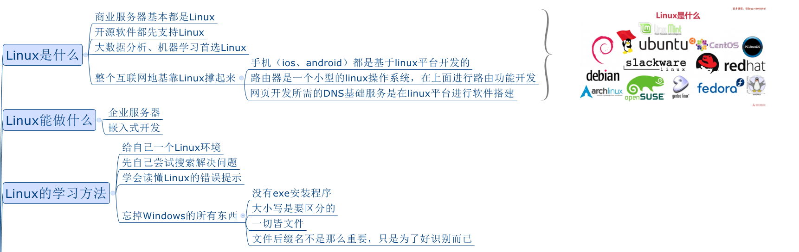
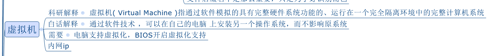
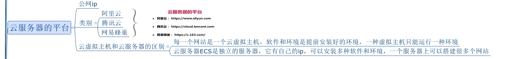

## 概览


## Linux 是什么

## 虚拟机
无公网Ip

## 云服务器平台

## 准备工作

### 查看ip
```shell
ifconfig
ip addr
vi /etc/sysconfig/network-scirpts/ifcfg-xx
# 使 linux 可以使用ifconfig命令
yum install net-tools
# 查看公网ip
curl cip.cc 
# 重启
service network restart
```
### 替换默认源
网址
http://mirrors.163.com/.help/centos.html

```
yum install wget 
```
首先备份/etc/yum.repos.d/CentOS-Base.repo
```
mv /etc/yum.repos.d/CentOS-Base.repo /etc/yum.repos.d/CentOS-Base.repo.backup
```
下载对应版本repo文件, 放入/etc/yum.repos.d/(操作前请做好相应备份)

```
wget 右键复制对应的系统链接
```
运行以下命令生成缓存
```
yum clean all
yum makecache

```

### 安装vim


## 远程服务器管理工具 SSH


### SSH 是什么
- Secure Shell 安全外壳协议
- 建立在应用层基础上的安全协议
- 可靠，专为远程登录会话和其他网络服务提供安全性的协议
- 有效防止远程管理过程中的信息泄露问题
- SSH 客户端适用于多种平台
- SSH 服务端几乎支持所有UNIX平台


### 服务器安装SSH服务

>PS:服务器端的默认是安装了SSH的

```shell
# 安装SSH
yum install openssh-server
yum install openssh-clients
# 启动SSH
service sshd start
# 查看 
ps -ef |grep ssh
# 设置开机运行
chkconfig sshd on 
```


### SSH客户端连接服务器

### SSH.config 用法详解


### 免密码登录方案  SSH key

