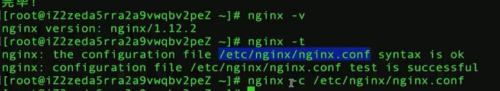
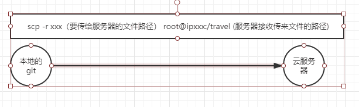

### 记一次前端的打包上传 和 最基本的 nginx 配置
1. 连接云服务器
2. 安装 nginx `yum install nginx`
3. 给 nginx 指定配置文件  `nginx -t`

4. 服务器根目录创建一个文件夹
5. 在本地项目根目录 传输文件至 服务器
  

6.修改配置文件（两种常用方式） 
  -  vim 修改 
  -  下载配置文件 到本地，修改完上传覆盖
` scp  root@xxx:/etc/nginx/nginx.conf /f
`
` scp  /f/nginx.conf  root@xxx:/etc/nginx/
`

7. 配置文件中

8. 完成