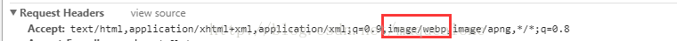
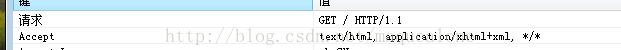

## 图片的优化

前言：

就图片这块来说，与其说我们是在做“优化”，不如说我们是在做“权衡”。因为我们要做的事情，就是去压缩图片的体积（或者一开始就选取体积较小的图片格式）。但这个优化操作，是以牺牲一部分成像质量为代价的。因此我们的主要任务，是尽可能地去寻求一个质量与性能之间的平衡点。


### 不同业务场景下的图片方案选型

#### 前置知识：二进制位数与色彩的关系

在计算机中，像素用二进制数来表示。不同的图片格式中像素与二进制位数之间的对应关系是不同的。一个像素对应的二进制位数越多，它可以表示的颜色种类就越多，成像效果也就越细腻，文件体积相应也会越大。

一个二进制位表示两种颜色（0|1 对应黑|白），如果一种图片格式对应的二进制位数有 n 个，那么它就可以呈现 2^n 种颜色。

#### JPEG/JPG

关键字：**有损压缩、体积小、加载快、不支持透明**

- 使用场景
JPG 适用于呈现色彩丰富的图片，在我们日常开发中，JPG 图片经常作为大的背景图、轮播图或 Banner 图出现。

两大电商网站对大图的处理，是 JPG 图片应用场景的最佳写照：

打开淘宝首页，我们可以发现页面中最醒目、最庞大的图片，一定是以 .jpg 为后缀的：

- JPG 的缺陷
	- 一般**Logo** 和 **矢量图形**不能使用jpg格式，且不支持透明度处理

#### PNG-8 与 PNG-24
关键字：**无损压缩、质量高、体积大、支持透明**

唯一缺点：体积大

#### SVG 

关键字：**文本文件、体积小、不失真、兼容性好**

- 文本文件，文件体积更小，可压缩性更强。
- 作为矢量图，它最显著的优势还是在于图片可无限放大而不失真这一点上。这使得 SVG 即使是被放到视网膜屏幕上，也可以一如既往地展现出较好的成像品质——1 张 SVG 足以适配 n 种分辨率。
- 一方面是它的渲染成本比较高，这点对性能来说是很不利的。
- 另一方面，SVG 存在着其它图片格式所没有的学习成本（它是可编程的）。


#### Base64

关键字：**文本文件、依赖编码、小图标解决方案**

>前置知识：雪碧图

>图像精灵（sprite，意为精灵），被运用于众多使用大量小图标的网页应用之上。它可取图像的一部分来使用，使得使用一个图像文件替代多个小文件成为可能。相较于一个小图标一个图像文件，单独一张图片所需的 HTTP 请求更少，对内存和带宽更加友好。

和雪碧图一样，Base64 图片的出现，也是为了减少加载网页图片时对服务器的请求次数，从而提升网页性能。**Base64 是作为雪碧图的补充而存在的。**


**Base64 是一种用于传输 8Bit 字节码的编码方式，通过对图片进行 Base64 编码，我们可以直接将编码结果写入 HTML 或者写入 CSS，从而减少 HTTP 请求的次数。**


##### Base64 的应用场景

Base64 编码后，图片大小会膨胀为原文件的 4/3（这是由 Base64 的编码原理决定的）。如果我们把大图也编码到 HTML 或 CSS 文件中，后者的体积会明显增加，即便我们减少了 HTTP 请求，也无法弥补这庞大的体积带来的性能开销，得不偿失。
在传输非常小的图片的时候，Base64 带来的文件体积膨胀、以及浏览器解析 Base64 的时间开销，与它节省掉的 HTTP 请求开销相比，可以忽略不计，这时候才能真正体现出它在性能方面的优势。


因此，Base64 并非万全之策，我们往往在一张图片满足以下条件时会对它应用 Base64 编码：

- 图片的实际尺寸很小
- 图片无法以雪碧图的形式与其它小图结合（合成雪碧图仍是主要的减少 HTTP 请求的途径，Base64 是雪碧图的补充）
- 图片的更新频率非常低（不需我们重复编码和修改文件内容，维护成本较低）


实际使用：`url-loader`

#### WebP

- WebP 像 JPEG 一样对细节丰富的图片信手拈来，像 PNG 一样支持透明，像 GIF 一样可以显示动态图片——它集多种图片文件格式的优点于一身。
- 兼容性不好

>使用场景——优雅降级（客户端）

```html
	<picture>
	  <source srcset="bg.webp" type="image/webp">
	  <source srcset="bg.jpg" type="image/jpeg"> 
	  
	</picture>

```

>使用场景——优雅降级（服务端）

服务器根据 HTTP 请求头部的 Accept 字段来决定返回什么格式的图片。当 Accept 字段包含 image/webp 时，就返回 WebP 格式的图片，否则返回原图。这种做法的好处是，当浏览器对 WebP 格式图片的兼容支持发生改变时，我们也不用再去更新自己的兼容判定代码，只需要服务端像往常一样对 Accept 字段进行检查即可。





### 打包构建中的图片压缩

- 可以在一些图片压缩网站上进行在线压缩。比如[tinypng](https://tinypng.com/)、[图好快](https://www.tuhaokuai.com/)、[智图](https://zhitu.isux.us/)、[jpeg io](https://www.jpeg.io/)、[Optimizilla](https://imagecompressor.com/)。推荐tinypng。

- 在webpack里面压缩图片的解决方案，主要使用基于imagemin插件的imagemin-webpack-plugin插件。

`npm install imagemin-webpack-plugin`

基本使用

```js
var ImageminPlugin = require('imagemin-webpack-plugin').default
// Or if using ES2015:
// import ImageminPlugin from 'imagemin-webpack-plugin'

module.exports = {
  plugins: [
    // Make sure that the plugin is after any plugins that add images
    new ImageminPlugin({
      disable: process.env.NODE_ENV !== 'production', // Disable during development
      pngquant: {
        quality: '95-100'
      }
    })
  ]
}

// 和 copy-webpack-plugin 一起使用
plugins: [
    ...
    new CopyWebpackPlugin([{
    from: 'public/img',
    to: 'niubi'
}]),
    new ImageminPlugin({
    test: /\.(jpe?g|png|gif|svg)$/i,
    // disable: process.env.NODE_ENV !== 'production', // Disable during development
    pngquant: {
        quality: '30-50'
    }
})
    ...
]

```


需要注意，打包的时候，这个插件必须放置在处理图片的插件后面,如 `copy-webpack-plugin`

常用配置项:

```
- pngquant: 设置压缩图片的品质，建议设置为95-100。
- minFileSize: 设置多大以上的图片才压缩，单位是比特，建议设置为5120，即5k以上的图片才压缩。
- test: 设置那里的图片才压缩，这里的路径是打包后的路径，如果打包后图片存放的文件夹是img，那么这里的值是：/img\/.*\.(jpe?g|png|gif|svg)$/i。
- plugins: 使用其他插件
```

#### JPG/JPEG 压缩与渐进式图片

压缩 jpg/jpeg 图片的方式与 png 类似，imagemin 提供了两个插件：jpegtrain 和 mozjpeg 供我们使用。一般我们选择 mozjpeg，它拥有更丰富的压缩选项:

```js
import ImageminPlugin from 'imagemin-webpack-plugin'
import imageminMozjpeg from 'imagemin-mozjpeg'

module.exports = {
  plugins: [
    new ImageminPlugin({
      plugins: [
        imageminMozjpeg({
          quality: 100,
          progressive: true
        })
      ]
    })
  ]
}
```

区别：

关于渐进式图片，它允许在加载照片的时候，如果网速比较慢的话，先显示一个类似模糊有点小马赛克的质量比较差的照片，然后慢慢的变为清晰的照片：


而相比之下，非渐进式的图片 (Baseline JPEG) 则会老老实实地从头到尾去加载：


当然，交错式 png 也可以实现相应的效果，但目前 pngquant 没有实现转换功能，但是 ps 中导出 png 时是可以设置为交错式的。


### 图片按需加载

1. 监听页面滚动位置，符合了条件再去进行资源的加载
2. 使用  IntersectionObserver

```html
<li>
  
</li>
<li>
  
</li>
<li>
  
</li>
<li>
  
</li>

```

```js
const observer = new IntersectionObserver(function(changes) {
  changes.forEach(function(element, index) {
   // 当这个值大于 0，说明满足我们的加载条件了，这个值可通过 rootMargin 手动设置
    if (element.intersectionRatio > 0) {
      // 放弃监听，防止性能浪费，并加载图片。
      observer.unobserve(element.target);
      element.target.src = element.target.dataset.src;
    }
  });
});
function initObserver() {
  const listItems = document.querySelectorAll('.list-item-img');
  listItems.forEach(function(item) {
   // 对每个 list 元素进行监听
    observer.observe(item);
  });
}
initObserver();

```

[线上 demo ](https://codepen.io/fecoder2019/pen/Vomyge)


### 有可能出现的负优化

base64唯一的目的，就是**减少HTTP请求数**

>base64可能产生的负优化
1. 让 css 文件的体积失去控制

2. 让浏览器的资源缓存策略功亏一篑

   假设你的 base64Url 会被你的应用多次复用，本来浏览器可以直接从本地缓存取出的图片，换成 base64Url，将造成应用中多个页面重复下载 1.3 倍大小的文本，假设一张图片是 100kb 大小，被你的应用使用了 10 次，那么造成的流量浪费将是:`(100 * 1.3 * 10)`- 100 = 1200kb。

3. 低版本浏览器的兼容问题

4. 不利于开发者工具调试与查看 

   无论哪张图片，看上去都是一堆没有意义的字符串，光看代码无法知道原图是哪张，不利于某些情况下的比对。


> 参考

[谈谈 Web 应用中的图片优化技巧](https://www.infoq.cn/article/gxV277O5ZZsR5w5er4pE)

[前端性能优化原理与实践](https://juejin.im/book/5b936540f265da0a9624b04b)

[渐进式 jpeg(progressive jpeg) 图片及其相关](https://www.zhangxinxu.com/wordpress/2013/01/progressive-jpeg-image-and-so-on/)