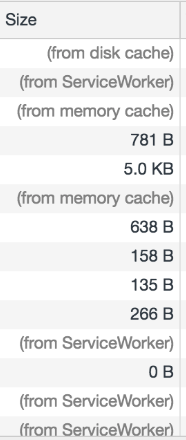
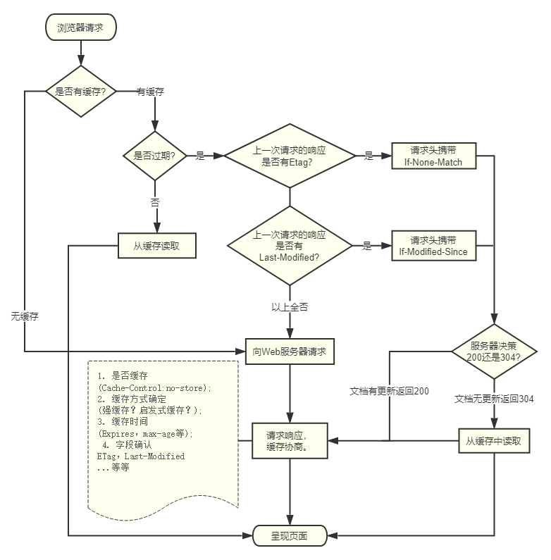
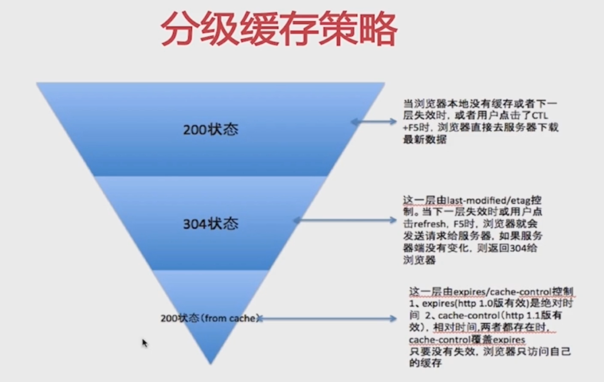
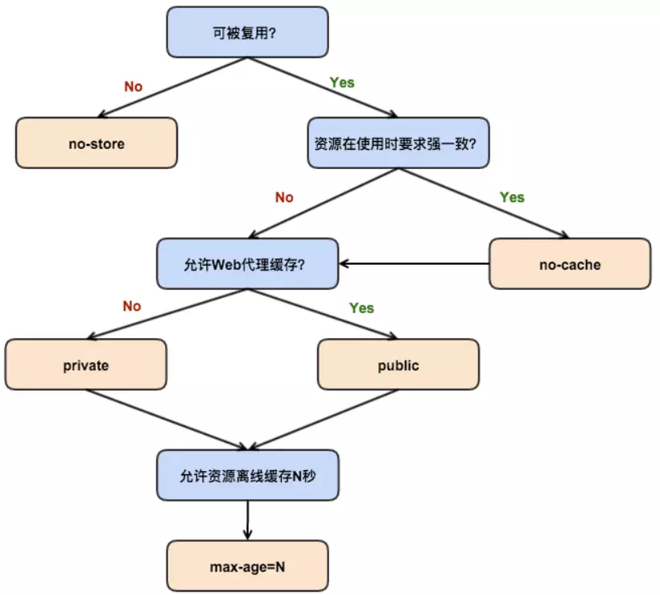

## 缓存（主要是前端方面）
一般来说，缓存主要分为下面几类
- 浏览器缓存 （前端来说主要关注这个）
- 代理服务器缓存
- 网关缓存
- 数据库缓存

浏览器缓存机制有四个方面，它们按照获取资源时请求的优先级依次排列如下：

1. Memory Cache
2. Service Worker Cache
3. HTTP Cache
4. Push Cache （HTTP2的新特性）

### HTTP缓存

>缓存流程

>分级缓存策略

三级缓存原理
1. 先去内存看，如果有，直接加载

2. 如果内存没有，择取硬盘获取，如果有直接加载

3. 如果硬盘也没有，那么就进行网络请求

4. 加载到的资源缓存到硬盘和内存

#### 强缓存 (本地缓存)

强缓存是最彻底的缓存，无需向服务器发送请求，通常用于css、js、图片等静态资源。浏览器发送请求后会先判断本地是否有缓存。如果无缓存，则直接向服务器发送请求；如果有缓存，则判断缓存是否命中强缓存，如果命中则直接使用本地缓存，如果没命中则向服务器发送请求。判断是否命中本地缓存的方法有两种：Expires和Cache-Control。

- **Cache-Control**
    属性:
    - max-age ( 优先级比过期时间`expires`要高 )
    - s-maxage ( 优先级比`max-age`要高,设置的是public相关缓存设备(代理服务器)的缓存时间 )
    - private
    - public
    - no-cache ( 它会先发送请求到服务端，通过服务端像Last-Modified这样的信息来进一步判断浏览器缓存有没有过期 )
    - no-store (不会对文件使用缓存)

**(`from memory cache`)和(`from disk cache`)两者的区别**
- 内存缓存(`from memory cache`)
内存缓存具有两个特点，分别是快速读取和时效性：
快速读取：内存缓存会将编译解析后的文件，直接存入该进程的内存中，占据该进程一定的内存资源，以方便下次运行使用时的快速读取。
时效性：缓存时效性很短，会随着进程的释放而释放

- 硬盘缓存(`from disk cache`)
硬盘缓存则是直接将缓存写入硬盘文件中，读取缓存需要对该缓存存放的硬盘文件进行I/O操作，然后重新解析该缓存内容，读取复杂，速度比内存缓存慢。

>一般而言，图片、字体等体积小的会被塞进 `memory cache`,而CSS会被存进磁盘，因为CSS样式加载一次即可渲染出网页，JS则不太确定

- Expires

注：**Cache-Control** 可以视作是 **expires** 的完全替代方案。在当下的前端实践里，我们继续使用 expires 的唯一目的就是向下兼容。

#### 协商缓存

##### Last-Modified/If-Modified-Since
描述：
- 基于客户端和服务端协商的缓存机制
- last-modified————response header
- if-modified-since————request header
- 需要与cache-control共同使用   ( 如果配置了 max-age,会优先从缓存中取，等max-age过期了再走协商缓存 )

缺点：
>- 某些服务端不能获取精确的修改时间
>- 文件修改时间改了，但文件内容却没有变

##### **Etag/If-None-Match**

描述：
- 文件内容的hash值
- etag————response header
- if-node-match————request header
- 需要与 cache-control 共同使用

如果 if-none-match 和 etag 对应上，状态码就是304 (从缓存中读取) ；反之就是200 (去服务器请求) 

**对比** `Last-Modified/If-Modified-Since`缓存策略和 `Etag/If-None-Match`
前者实际上对比的是时间，后者对比的是文件的不同；前者在毫秒级别的改变上可能存在较大延迟。
**优先级**：`Etag/If-None-Match` 比 `Last-Modified/If-Modified-Since` 高

### 实际实践相关
缓存的意义就在于减少请求，更多地使用本地的资源，给用户更好的体验的同时，也减轻服务器压力。所以，最佳实践，就应该是尽可能命中**强缓存**，同时，能在更新版本的时候让客户端的缓存失效。

利用webpack打包构建工具，可以实现分包带上hash值，具体的配置webpack文档配置缓存篇有一个比较基础的配置

通常来说，会用到contenthash

>附 webpack 提供的三种哈希计算方式
- hash：跟整个项目的构建相关，构建生成的文件hash值都是一样的，只要项目里有文件更改，整个项目构建的hash值都会更改。
- chunkhash：根据不同的入口文件(Entry)进行依赖文件解析、构建对应的chunk，生成对应的hash值。
- contenthash：由文件内容产生的hash值，内容不同产生的contenthash值也不一样。

另外，关键的一个插件`HashedModuleIdsPlugin`大致做了什么的讲解 [webpack学习笔记-缓存优化](https://segmentfault.com/a/1190000011832495)

## 参考

1.  [深入理解浏览器的缓存机制](https://www.jianshu.com/p/54cc04190252)

2.  [内存缓存和硬盘缓存的区别](http://xbhong.top/2018/04/16/fromCacheType/)
3.  [切底了解浏览器缓存](https://juejin.im/entry/5ad86c16f265da505a77dca4)

4.  [内存缓存(from memory cache)和硬盘缓存(from disk cache) 的区别](https://blog.csdn.net/FengNext/article/details/100172186)