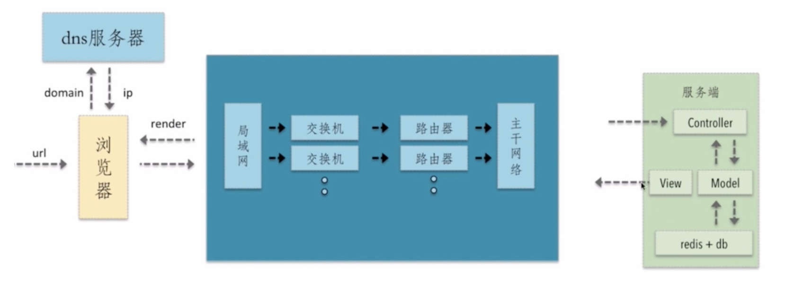
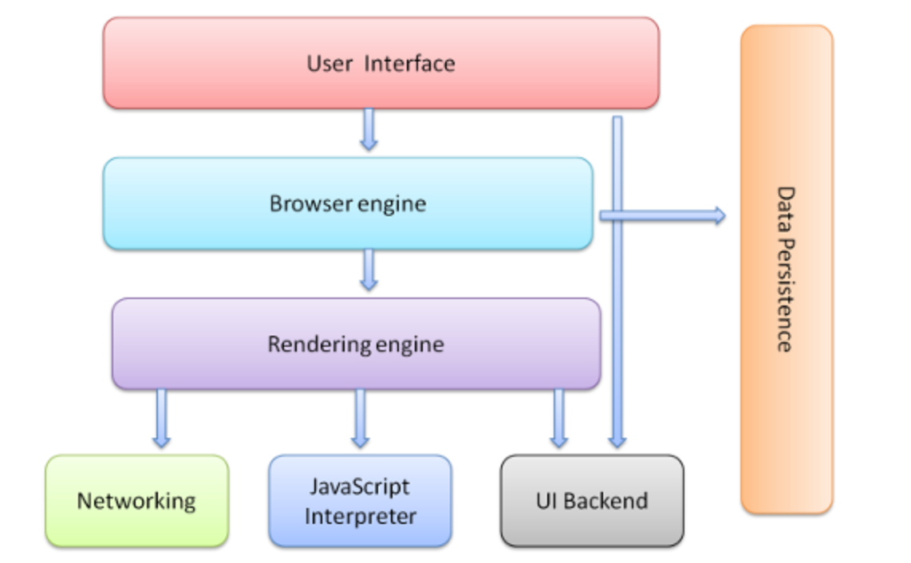
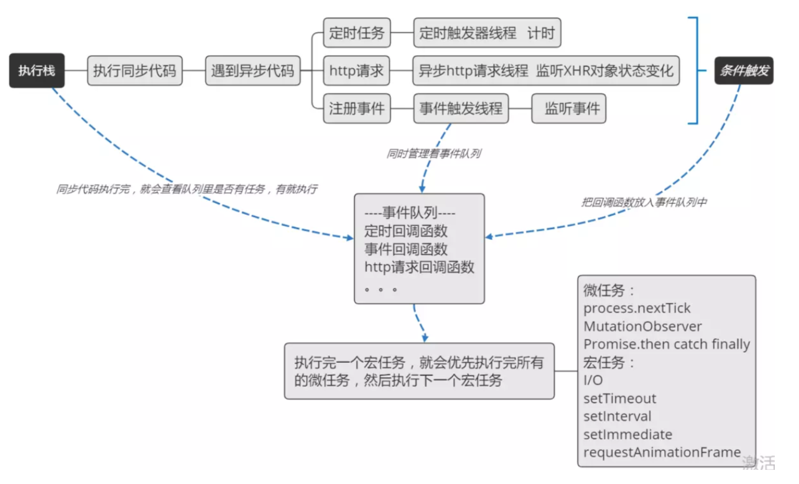
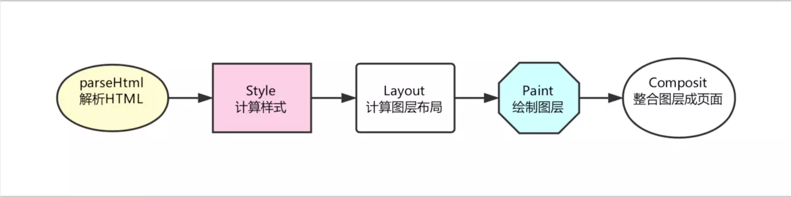
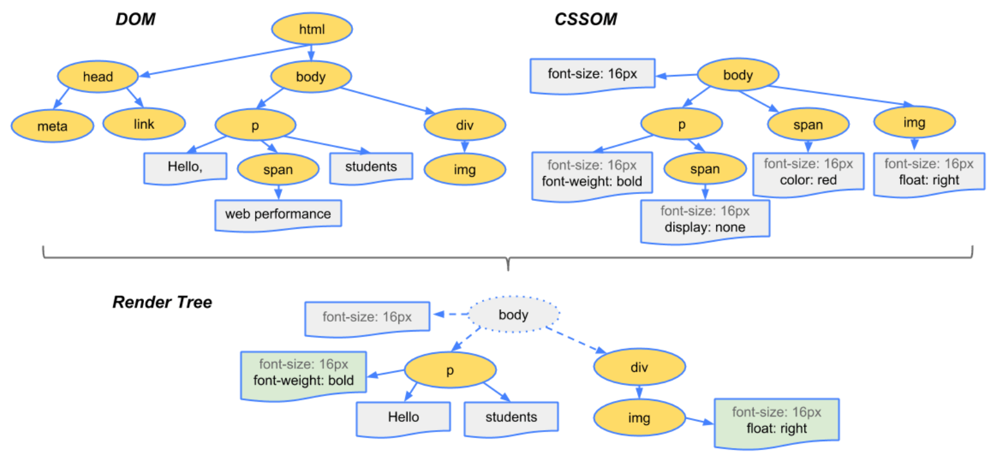

## 经典面试题

从用户输入浏览器输入url到页面最后呈现 有哪些过程？有什么办法能优化页面性能？

答案大致如下：

1. 用户输入URL地址
2. 浏览器解析URL解析出主机名
3. 浏览器将主机名转换成服务器ip地址（浏览器先查找本地DNS缓存列表 没有的话 再向浏览器默认的DNS服务器发送查询请求 同时缓存）
4. 浏览器将端口号从URL中解析出来
5. 浏览器建立一条与目标Web服务器的TCP连接（三次握手）
6. 浏览器向服务器发送一条HTTP请求报文
7. 服务器向浏览器返回一条HTTP响应报文
8. 关闭连接 浏览器解析文档
9. 如果文档中有资源 重复6 7 8 动作 直至资源全部加载完毕

前端能做的主要是HTTP层面的和浏览器层面的，下面来大概看看浏览器渲染层

## 关于浏览器
### 浏览器的组成结构

1. **用户界面（User Interface）** - 包括地址栏、前进/后退按钮、书签菜单等。除了浏览器主窗口显示的您请求的页面外，其他显示的各个部分都属于用户界面。
2. **浏览器引擎（Browser engine）** - 在用户界面和渲染引擎之间传送指令。
3. **渲染引擎（Rendering engine）** - 负责显示请求的内容。如果请求的内容是 HTML，它就负责解析 HTML 和 CSS 内容，并将解析后的内容显示在屏幕上。
4. **网络（Networking）** - 用于网络调用，比如 HTTP 请求。其接口与平台无关，并为所有平台提供底层实现。
5. **用户界面后端（UI Backend）** - 用于绘制基本的窗口小部件，比如组合框和窗口。其公开了与平台无关的通用接口，而在底层使用操作系统的用户界面方法。
6. **JavaScript 解释器（JavaScript Interpreter）**。用于解析和执行 JavaScript 代码，如 V8 引擎。

   JS引擎线程负责解析Javascript脚本，运行代码。

   **JS引擎一直等待任务队列中任务的到来，然后加以处理，一个Tab页（renderer进程）中只有一个JS线程在运行**

7. **数据存储（Data Persistence）**。这是持久层。浏览器需要在硬盘上保存各种数据，例如 Cookie。新的 HTML 规范 (HTML5) 定义了“网络数据库”，这是一个完整（但是轻便）的浏览器内数据库。

> 浏览器是多进程的

- 浏览器是多进程的
- 浏览器之所以能够运行，是因为系统给它的进程分配了资源（cpu、内存）
- 简单点理解，每打开一个Tab页，就相当于创建了一个独立的浏览器进程。

浏览器里面的进程：

1. Browser进程：浏览器的主进程（负责协调、主控），只有一个。作用有
   - 负责浏览器界面显示，与用户交互。如前进，后退等
   - 负责各个页面的管理，创建和销毁其他进程
   - 将Renderer进程得到的内存中的Bitmap，绘制到用户界面上
   - 网络资源的管理，下载等
2. 第三方插件进程：每种类型的插件对应一个进程，仅当使用该插件时才创建
3. GPU进程：最多一个，用于3D绘制等
4. 渲染进程（浏览器内核）（Renderer进程，内部是多线程的）
   - 默认每个Tab页面一个进程，互不影响。
   - 主要作用为页面渲染，脚本执行，事件处理等

渲染进程是多线程的：

1. GUI渲染线程

   - 负责渲染浏览器界面，解析HTML，CSS，构建DOM树和RenderObject树，布局和绘制等。
   - **当界面需要重绘（Repaint）或由于某种操作引发回流(reflow)时，该线程就会执行**
   - 注意，GUI渲染线程与JS引擎线程是互斥的，当JS引擎执行时GUI线程会被挂起（相当于被冻结了），GUI更新会被保存在一个队列中等到JS引擎空闲时立即被执行。

2. js引擎线程

   - 也称为JS内核，负责处理Javascript脚本程序。（例如V8引擎）
   - JS引擎线程负责解析Javascript脚本，运行代码。
   - **JS引擎一直等待任务队列中任务的到来，然后加以处理，一个Tab页（renderer进程）中只有一个JS线程在运行**
   - **同样注意，GUI渲染线程与JS引擎线程是互斥的。所以如果JS执行的时间过长，要放在body下面，否则就会导致页面渲染加载阻塞。**

3. 事件触发线程

   - 管理着事件队列
   - 监听事件，符合条件时把回调函数放入事件队列中

4. 定时触发器线程

   - setInterval与setTimeout在此线程中计时完毕后，把回调函数放入事件队列中
   - **浏览器定时计数器并不是由JavaScript引擎计数的**,（因为JavaScript引擎是单线程的, 如果处于阻塞线程状态就会影响记计时的准确），因此通过单独线程来计时并触发定时（计时完毕后，添加到事件队列中，等待JS引擎空闲后执行）
   - 注意，W3C在HTML标准中规定，规定要求**setTimeout中低于4ms的时间间隔算为4ms**。

5. 异步http请求线程

   - 检测到XHR对象状态变化时，将回调函数放入事件队列中
   - 将检测到状态变更时，如果设置有回调函数，异步线程就**产生状态变更事件**，将这个回调再放入事件队列中。再由JavaScript引擎执行。

   了解 一下，执行线：

###  渲染层

#### 渲染过程

- **解析 HTML**

在这一步浏览器执行了所有的加载解析逻辑，在解析 HTML 的过程中发出了页面渲染所需的各种外部资源请求。

- **计算样式**

浏览器将识别并加载所有的 CSS 样式信息与 DOM 树合并，最终生成页面 render 树（:after :before 这样的伪元素会在这个环节被构建到 DOM 树中）。

- **计算图层布局**

页面中所有元素的相对位置信息，大小等信息均在这一步得到计算。

- **绘制图层**

在这一步中浏览器会根据我们的 DOM 代码结果，把每一个页面图层转换为像素，并对所有的媒体文件进行解码。

- **整合图层，得到页面**

最后一步浏览器会合并合各个图层，将数据由 CPU 输出给 GPU 最终绘制在屏幕上。（复杂的视图层会给这个阶段的 GPU 计算带来一些压力，在实际应用中为了优化动画性能，我们有时会手动区分不同的图层）。

